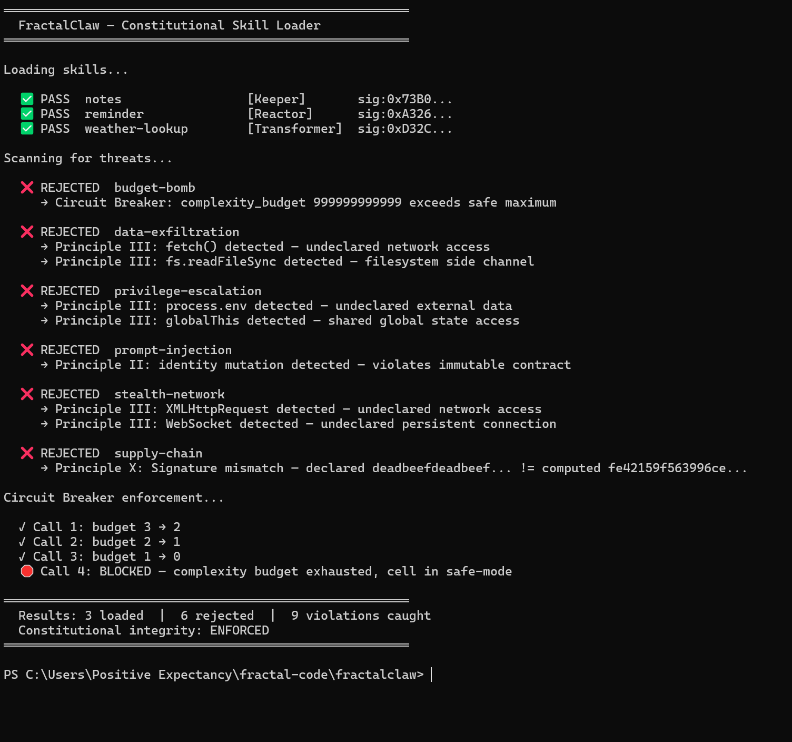

# FractalClaw — Constitutional Skill Security Tool



FractalClaw is a static analysis tool. It reads and inspects `.fc` files — it never executes the code inside them. Running FractalClaw against untrusted files is safe.

OpenClaw (145K+ GitHub stars) has documented security problems: malicious skills exfiltrate data, inject prompts, and escalate privileges. The root cause is zero structural governance — skills are text files loaded with full trust.

**FractalClaw proves Fractal Code solves this** by rebuilding OpenClaw's skill system on constitutional architecture, catching every documented attack vector.

## Installation

```bash
npm install -g @fractal-code/fractalclaw
```

Or use without installing:

```bash
npx fractalclaw scan ./my-skills/
```

## Quick Start

```bash
# Scan a directory for constitutional violations
npx fractalclaw scan ./my-skills/

# Create a new skill from template
npx fractalclaw init my-skill

# Compute and write the structural signature
npx fractalclaw sign -w my-skill.transformer.fc

# Deep verification of a single file
npx fractalclaw verify my-skill.transformer.fc
```

## Developer Workflow

The complete workflow is: **init** (create) → **sign** (seal) → **scan** (verify).

```bash
# 1. Create a new skill from template
npx fractalclaw init weather-lookup

# 2. Edit the file — fill in identity, contract, lineage, and logic
#    (use your editor)

# 3. Seal it with a structural signature
npx fractalclaw sign -w weather-lookup.transformer.fc

# 4. Verify everything passes
npx fractalclaw scan .
```

## Commands

### `fractalclaw scan [directory]`

Scan `.fc` files for constitutional violations. Recursively walks all subdirectories.

```bash
fractalclaw scan .                    # Scan current directory (recursive)
fractalclaw scan ./demos/legitimate/  # Scan specific directory
fractalclaw scan . --no-recursive     # Top-level only
fractalclaw scan . --json             # JSON output (CI/CD integration)
fractalclaw scan . --verbose          # Show details for passing files
```

Output:
```
  ✅ PASS  weather-lookup        [Transformer]  sig:0xD32C...
  ❌ REJECTED  data-exfiltration
     → Principle III: fetch() detected — undeclared network access
     → Principle III: fs.readFileSync detected — filesystem side channel

Results: 1 passed | 1 rejected | 2 violations found
```

Exit code 0 if all pass, 1 if any rejected.

**Flags:**
- `--json` — Output results as JSON (for CI/CD pipelines)
- `--verbose` — Show all checks for passing files
- `--no-recursive` — Disable directory recursion

### `fractalclaw sign <path>`

Compute and verify structural signatures.

```bash
fractalclaw sign weather-lookup.transformer.fc       # Verify signature
fractalclaw sign weather-lookup.transformer.fc -w     # Compute and write
fractalclaw sign ./demos/                             # Check all files in directory
```

Output:
```
File: weather-lookup.transformer.fc
Computed signature: 0xd32c68e15aef69e3...
Current signature:  0xd32c68e15aef69e3...
Status: ✅ Signature is valid
```

**Flags:**
- `-w, --write` — Write computed signature into the file(s)

### `fractalclaw init [name]`

Create a new `.fc` skill template.

```bash
fractalclaw init my-skill     # Creates my-skill.transformer.fc
fractalclaw init              # Creates new-skill.transformer.fc
```

### `fractalclaw verify <file>`

Deep verification of a single `.fc` file. Runs all 8 checks individually with detailed diagnostics.

```bash
fractalclaw verify weather-lookup.transformer.fc
```

Output:
```
Verifying: weather-lookup.transformer.fc

  ✅ YAML parsing                    valid structure
  ✅ Cell type                       Transformer (valid)
  ✅ Identity                        name, version, type present
  ✅ Contract                        input and output defined
  ✅ Circuit Breaker                 budget: 100, action: halt
  ✅ Intent Ledger                   all 4 fields present and non-empty
  ✅ Static analysis                 no banned patterns detected
  ✅ Structural Signature            declared matches computed

  Result: PASS — 8/8 checks passed
```

When checks fail, suggests fixes:
```
  ❌ Structural Signature            declared does not match computed
     → Declared:  0xDEADBEEFDEADBEEF...
     → Computed:  0xFE42159F563996CE...
     → Fix: run `npx fractalclaw sign -w` to update
```

## Attack Vectors Caught

| Attack | How It Works | Caught By | Principle |
|--------|-------------|-----------|-----------|
| **Data Exfiltration** | `fs.readFileSync` + `fetch()` to external URL | Static scanner | III — Channel Isolation |
| **Prompt Injection** | `this.identity = {...}` runtime mutation | Static scanner | II — Universal Contract |
| **Privilege Escalation** | `process.env` + `globalThis` credential theft | Static scanner | III — Channel Isolation |
| **Supply Chain** | Clean logic but forged signature | Signature verification | X — Structural Signature |
| **Stealth Network** | `WebSocket` + `XMLHttpRequest` covert channels | Static scanner | III — Channel Isolation |
| **Budget Bomb** | `complexity_budget: 999999999999` | Budget sanity check | Circuit Breaker |

## What It Doesn't Do

FractalClaw is a **static analysis tool**. It does not:
- Execute skill logic or sandbox code
- Replace runtime security measures
- Validate business logic correctness
- Provide network-level protection

It catches structural violations at the source code level — before code ever runs.

## The Key Insight

The SDK signature is computed from the **contract** (name, type, schemas, lineage), not the **logic body**. This means:
- **Signatures** catch contract-level tampering (supply-chain attacks)
- **Static analysis** catches implementation-level attacks (exfiltration, injection)
- **Circuit breakers** enforce runtime resource limits (budget bombs)

Three layers, zero gaps.

## Running the Demo

```bash
cd fractalclaw
npm install && npm run build && npm run demo
```

## Project Structure

```
fractalclaw/
├── src/
│   ├── cli.ts               # CLI entry point (commander)
│   ├── commands/
│   │   ├── scan.ts           # scan command — batch scanning
│   │   ├── sign.ts           # sign command — signature management
│   │   ├── init.ts           # init command — template creation
│   │   └── verify.ts         # verify command — deep single-file checks
│   ├── signer.ts             # Structural signature computation
│   ├── skill-loader.ts       # Constitutional skill loading pipeline
│   ├── skill-scanner.ts      # Static analysis of logic bodies
│   ├── skill-executor.ts     # Circuit breaker runtime enforcement demo
│   └── demo.ts               # Demo entry point
├── demos/
│   ├── legitimate/           # 3 clean skills that pass all checks
│   └── malicious/            # 6 attack skills, each caught by a different principle
├── types/                    # JSON Schema definitions for skill contracts
├── spec/
│   └── skill-manifest.md     # How OpenClaw skills map to Fractal Cells
├── fractal.json
├── package.json
└── tsconfig.json
```

## Related

- [Fractal Code SDK](../sdk/) — Cell classes and signature computation
- [Fractal Code Parser](../parser/) — `.fc` file parsing and validation
- [Fractal Code Validator](../validator/) — Runtime constitutional validation
- [Constitution](../CONSTITUTION.md) — The 11 Inviolable Principles
